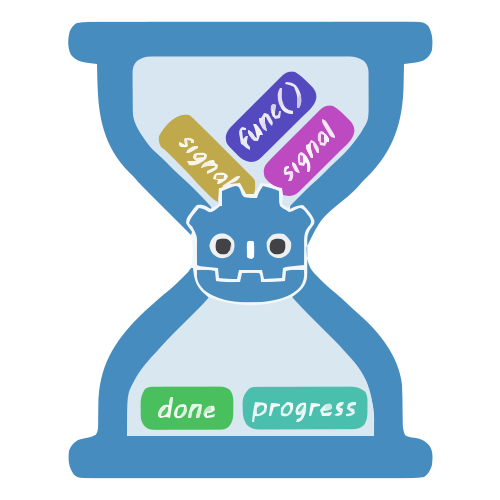

<p align="center">
  
</p>

<h1 align="center">
  Awaiter Plugin
</h1>

<p align="center">
  <a href="https://ko-fi.com/I2I31KH5HB" target="_blank">
	
  </a>
</p>


## See my other plugins

- [Projectile on curve 2D](https://github.com/MeroVinggen/Godot-ProjectileOnCurve2DPlugin)
- [Android Internet Connection State](https://github.com/MeroVinggen/Godot-AndroidInternetConnectionStatePlugin)
- [
Vector2 editor](https://github.com/MeroVinggen/Godot-Vector2ArrayEditorPlugin)
- [
Threaded Resource Save-Load](https://github.com/MeroVinggen/Godot-ThreadedResourceSaveLoadPlugin)


## About

A plugin for managing asynchronous tasks in Godot. Await multiple signals or async calls with intuitive helpers: all(), any(), and some()


## Features

- use await or signals seamlessly
- built-in `progress` and `done` signals
- wait for all async tasks to finish with `Awaiter.all()`
- wait for any task to finish with `Awaiter.any()`
- wait for N tasks to finish with `Awaiter.some()`
  

## Requirements 

- Godot 4.2 or higher


## Installation

- Open the `AssetLib` tab in Godot with your project open
- Search for `Awaiter` plugin and install the plugin by Mero
- Open Project -> Project Settings -> Plugins Tab and enable the plugin `Awaiter`
- Done!


## Usage examples

- usage via signals

```gdscript
# pass signals and async funcs
var task_manager: Awaiter._TaskManager = Awaiter.all([
  signal1,
  func1,
  ...
])

task_manager.done.connect(_on_done)
task_manager.progress.connect(_on_progress)
```

- inline usage

```gdscript
# pass signals and async funcs
var results = await Awaiter.all([
  signal1,
  func1,
  ...
]).done
```


## Methods

**`all`** - waiting for all of the tasks to complete

```gdscript
Awaiter.all(tasks: Array[Signal | Callable])
```

**`any`** - waiting for any of the tasks to complete

```gdscript
Awaiter.any(tasks: Array[Signal | Callable])
```

**`some`** - waiting for _\<n\>_ amount of the tasks to complete

```gdscript
Awaiter.some(tasks: Array[Signal | Callable], amount_to_complete: int)
```


### Signals

`done(result: Array)` - is emitted after completion (depending on used `method`)

`progress(complete: int, total: int)` - is emitted per complete task
